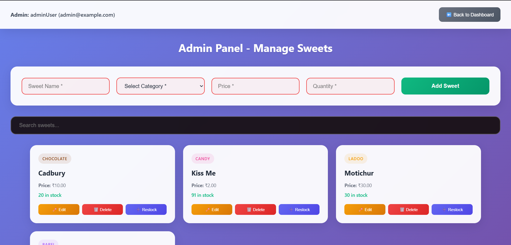

# Incubyte Assessment Project
# Incubyte Sweet Shop Management System

A full-stack web application for managing a sweet shop, built with **React**, **Node.js**, **Express**, and **MongoDB**. The system includes user and admin dashboards, JWT-based authentication, TDD-based development, and dynamic sweet inventory handling.

---

## 🔐 Admin Credentials

For testing the admin panel functionality, use the following credentials:

**Username:** `admin`  
**Password:** `Admin@123`

---

## 📸 Screenshots


*Login Page - User authentication interface with role-based login*


*User Registration - Sign up form for new users*


*User Dashboard - Main interface showing available sweets with purchase options*


*Admin Dashboard - Administrative interface for managing sweet inventory*


*Order Successful - Purchase confirmation notification*


*Profile Section - User profile dropdown with account details*


*Search Filter - Real-time search functionality for finding specific sweets*


*Sweet Category Filter - Filtering sweets by categories (Chocolate, Candy, Ladoo, Barfi)*


*Restock Functionality - Admin feature to add inventory to existing sweets*


*Edit Sweet - Inline editing interface for modifying sweet details*


*Delete Sweet - Confirmation dialog for removing sweets from inventory*


*Add Sweet - Form interface for adding new sweets to the inventory*


*Test Results - Jest test suite execution showing TDD implementation*

---

## ✨ Features

### 👤 Authentication
- User registration & login
- Role-based access control (User/Admin)
- JWT token validation

### 🛍️ User Dashboard
- View sweets with icons by category 
- Live stock quantity display
- Purchase with quantity selector
- Friendly purchase confirmation toast
- Filters:
  - Search by name
  - Filter by category
  - Price range slider (API-based filtering)

### 🧑‍💼 Admin Panel
- Add new sweets (form with validations)
- Edit sweet details inline
- Delete sweets
- Restock sweets
- Real-time inventory updates

---

## ⚙️ Tech Stack

| Layer        | Technology         |
|--------------|--------------------|
| Frontend     | React, CSS         |
| Backend      | Node.js, Express   |
| Database     | MongoDB, Mongoose  |
| Auth         | JWT                |
| Testing      | Jest, Supertest    |
| Deployment   | Localhost / GitHub |

---

## 📂 Project Structure

```
incubyte-sweet-shop/
├── backend/
│ ├── node_modules/
│ ├── src/
│ │ ├── controllers/
│ │ ├── config/
│ │ ├── auth/
│ │ ├── model/
│ │ ├── routes/
│ │ └── app.js
│ ├── test/
│ │ ├── auth.test.js
│ │ ├── inventory.test.js
│ │ ├── mongodbcon.test.js
│ │ ├── setUp.js
│ │ ├── Sweet.test.js
│ │ └── testUtils.js
│ ├── package.json
│ └── package-lock.json
│
├── sweet-shop-frontend/
│ ├── node_modules/
│ ├── public/
│ ├── src/
│ │ ├── assets/
│ │ ├── context/
│ │ ├── pages/
│ │ │ ├── AdminPanel.jsx
│ │ │ ├── AdminPanel.css
│ │ │ ├── Dashboard.jsx
│ │ │ ├── Dashboard.css
│ │ │ ├── Footer.jsx
│ │ │ ├── Footer.css
│ │ │ ├── Register.jsx
│ │ │ ├── Login.jsx
│ │ │ └── Login.css
│ │ ├── App.jsx
│ │ ├── App.css
│ │ ├── index.css
│ │ └── main.jsx
│ ├── index.html
│ ├── vite.config.js
│ ├── eslint.config.js
│ ├── package.json
│ └── package-lock.json
│
├── .gitignore

```


---

## 🚀 Getting Started

### Prerequisites
- Node.js (v14 or higher)
- MongoDB (local installation or MongoDB Atlas)
- Git

### Backend Setup

```
cd backend
npm install
npm install -g nodemon
```

```
Create .env file with your MongoDB connection string
echo "MONGODB_URI=mongodb://localhost:27017/sweet-shop" 
echo "JWT_SECRET=your-jwt-secret-key" 
nodemon src/app.js
```


### Frontend Setup

```
cd sweet-shop-frontend
npm install
```

```
Create .env file with backend API URL
echo "VITE_API_URL=http://localhost:5000"
npm run dev
```


### Running Tests
```
cd backend
npm test
```

---

## ✅ API Endpoints

### Auth
- `POST /api/auth/register` - User registration
- `POST /api/auth/login` - User login
- `GET /api/auth/user` - Get current user details

### Sweets (Protected Routes)
- `GET /api/sweets` - Get all sweets
- `POST /api/sweets` - Add new sweet (Admin only)
- `PUT /api/sweets/:id` - Update sweet details (Admin only)
- `DELETE /api/sweets/:id` - Delete sweet (Admin only)
- `POST /api/sweets/:id/restock` - Restock sweet inventory (Admin only)
- `POST /api/sweets/:id/purchase` - Purchase sweet (User)
- `GET /api/sweets/search?name=&category=&minPrice=&maxPrice=` - Search and filter sweets

---

## 🧪 Test Coverage
- API Unit Tests using **Jest + Supertest**
- Authentication middleware testing
- CRUD operations validation
- Error handling scenarios
- Database connection testing
- Sweet model validation tests

---

## 🤖 My AI Usage

### AI Tools Used
1. **ChatGPT (OpenAI)** - Primary AI assistant

### How AI Was Used

#### CSS Development
- **ChatGPT** was extensively used to create modern, responsive CSS files for all components
- Generated glassmorphism design patterns and animations for Login.css, Dashboard.css, and AdminPanel.css
- Created consistent color schemes and hover effects across all UI components
- Developed responsive grid layouts and mobile-first design patterns

#### Test Template Generation
- **ChatGPT** helped generate comprehensive Jest test templates for:
  - Authentication endpoints testing (auth.test.js)
  - Sweet model validation tests (Sweet.test.js)
  - Inventory management tests (inventory.test.js)
  - Database connection testing (mongodbcon.test.js)
- Created test utilities and setup files for consistent test environment

#### Debugging and Problem Solving
- **ChatGPT** helped troubleshoot:
  - JWT authentication flow issues
  - React state management and useContext dependencies
  - CSS layout and responsiveness issues

### Reflection on AI Impact

**Positive Impact:**
- **Accelerated Development**: AI tools significantly reduced development time, especially for CSS styling and test creation
- **Code Quality**: AI suggestions helped implement best practices and consistent patterns
- **Documentation Excellence**: AI assistance resulted in comprehensive, professional documentation

**Manual Implementation:**
- Core business logic was manually implemented and thoroughly tested
- Database schema design was carefully planned without AI dependency
- Security implementations (password hashing, JWT validation) were manually verified
- API endpoint logic and validation rules were custom-implemented

**Balanced Approach:**
AI tools served as powerful assistants for boilerplate generation and styling, while critical application logic, security features, and business rules were manually implemented to ensure full understanding and control over the codebase.

---

## 🧠 Project Highlights
- Fully responsive modern UI with glassmorphism design
- TDD-compliant development flow with comprehensive test coverage
- Real-time updates after add/edit/restock/purchase operations
- Clean modular code architecture with separation of concerns
- Professionally styled form validations and toast notifications
- Role-based authentication and authorization
- API-integrated search and filtering capabilities

---

## 👤 Author

**Shreyash Ghanekar**  
B.E. Student - Pune Institute of Computer Technology, Department of Information Technology  
Email: [shreyasghanekar35@gmail.com](mailto:shreyasghanekar35@gmail.com)  
GitHub: [github.com/ShreyashPG](https://github.com/ShreyashPG)  

Co-authored-by: ChatGPT <chatgpt@openai.noreply.github.com>  
Submitted as part of the **Incubyte Assessment** - AI Kata TDD Project.
